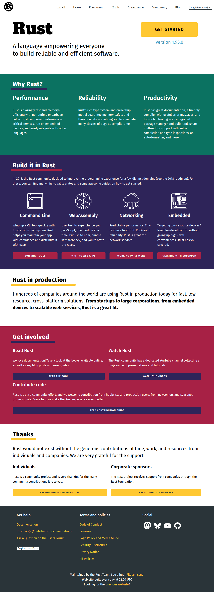

# Visited: https://rust-lang.org
**Time:** Sun May  3 06:27:16 UTC 2026

## Screenshot

## Raw HTML
[page.html](./page.html)

## Downloaded Media (0 files)
_No media files downloaded_

## Other Links
- [/](/)
- [/community](/community)
- [/governance](/governance)
- [/learn](/learn)
- [/learn/get-started](/learn/get-started)
- [/policies](/policies)
- [/policies/code-of-conduct](/policies/code-of-conduct)
- [/policies/licenses](/policies/licenses)
- [/policies/security](/policies/security)
- [/static/images/apple-touch-icon.png?v=ngJW8jGAmR](/static/images/apple-touch-icon.png?v=ngJW8jGAmR)
- [/static/images/safari-pinned-tab.svg?v=ngJW8jGAmR](/static/images/safari-pinned-tab.svg?v=ngJW8jGAmR)
- [/static/images/site.webmanifest?v=ngJW8jGAmR](/static/images/site.webmanifest?v=ngJW8jGAmR)
- [/static/scripts/highlight.pack.js](/static/scripts/highlight.pack.js)
- [/static/scripts/init.js](/static/scripts/init.js)
- [/static/scripts/languages.js](/static/scripts/languages.js)
- [/static/styles/a11y-dark.css](/static/styles/a11y-dark.css)
- [/static/styles/app_17774143076088586802.css](/static/styles/app_17774143076088586802.css)
- [/static/styles/fonts_8049871103083011125.css](/static/styles/fonts_8049871103083011125.css)
- [/static/styles/vendor_10880690442070639967.css](/static/styles/vendor_10880690442070639967.css)
- [/tools](/tools)
- [/tools/install](/tools/install)
- [/what/cli](/what/cli)
- [/what/embedded](/what/embedded)
- [/what/networking](/what/networking)
- [/what/wasm](/what/wasm)
- [http://forge.rust-lang.org](http://forge.rust-lang.org)
- [https://blog.rust-lang.org/](https://blog.rust-lang.org/)
- [https://blog.rust-lang.org/2018/03/12/roadmap.html](https://blog.rust-lang.org/2018/03/12/roadmap.html)
- [https://blog.rust-lang.org/releases/latest](https://blog.rust-lang.org/releases/latest)
- [https://bsky.app/profile/rust-lang.org](https://bsky.app/profile/rust-lang.org)
- [https://foundation.rust-lang.org/members](https://foundation.rust-lang.org/members)
- [https://foundation.rust-lang.org/policies/logo-policy-and-media-guide/](https://foundation.rust-lang.org/policies/logo-policy-and-media-guide/)
- [https://foundation.rust-lang.org/policies/privacy-policy/](https://foundation.rust-lang.org/policies/privacy-policy/)
- [https://github.com/rust-lang](https://github.com/rust-lang)
- [https://github.com/rust-lang/www.rust-lang.org/issues/new/choose](https://github.com/rust-lang/www.rust-lang.org/issues/new/choose)
- [https://play.rust-lang.org/](https://play.rust-lang.org/)
- [https://prev.rust-lang.org](https://prev.rust-lang.org)
- [https://rustc-dev-guide.rust-lang.org/getting-started.html](https://rustc-dev-guide.rust-lang.org/getting-started.html)
- [https://social.rust-lang.org/@rust](https://social.rust-lang.org/@rust)
- [https://thanks.rust-lang.org/](https://thanks.rust-lang.org/)
- [https://users.rust-lang.org](https://users.rust-lang.org)
- [https://www.rust-lang.org/](https://www.rust-lang.org/)
- [https://www.rust-lang.org/en-US](https://www.rust-lang.org/en-US)
- [https://www.rust-lang.org/es](https://www.rust-lang.org/es)
- [https://www.rust-lang.org/fr](https://www.rust-lang.org/fr)
- [https://www.rust-lang.org/it](https://www.rust-lang.org/it)
- [https://www.rust-lang.org/ja](https://www.rust-lang.org/ja)
- [https://www.rust-lang.org/pt-BR](https://www.rust-lang.org/pt-BR)
- [https://www.rust-lang.org/ru](https://www.rust-lang.org/ru)
- [https://www.rust-lang.org/tr](https://www.rust-lang.org/tr)

## Stats
- Links: 66
- Media: 0
